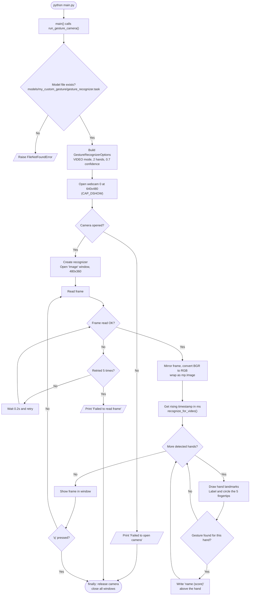

# DDU-Embodied-interaction

- https://miro.com/app/board/uXjVHpvOipU=/

- https://trello.com/b/A3hq1Uc4/ddu-embodied-interaction

```mermaid
flowchart TD
    A([python main.py]) --> B["main() calls run_gesture_camera()"]
    B --> C{"Model file exists?<br/>models/my_custom_gesture/gesture_recognizer.task"}
    C -- No --> X1[/Raise FileNotFoundError/]
    C -- Yes --> D["Build GestureRecognizerOptions<br/>VIDEO mode, 2 hands, 0.7 confidence"]
    D --> E["Open webcam 0 at 640x480<br/>(CAP_DSHOW)"]
    E --> F{Camera opened?}
    F -- No --> X2[/Print 'Failed to open camera'/] --> Z
    F -- Yes --> G["Create recognizer<br/>Open 'Image' window, 480x360"]

    G --> H[Read frame]
    H --> I{Frame read OK?}
    I -- No --> J{Retried 5 times?}
    J -- No --> K[Wait 0.2s and retry] --> I
    J -- Yes --> X3[/Print 'Failed to read frame'/] --> Z
    I -- Yes --> L["Mirror frame, convert BGR to RGB<br/>wrap as mp.Image"]
    L --> M["Get rising timestamp in ms<br/>recognize_for_video()"]
    M --> N{More detected hands?}
    N -- Yes --> O["Draw hand landmarks<br/>Label and circle the 5 fingertips"]
    O --> P{Gesture found for this hand?}
    P -- Yes --> Q["Write 'name (score)'<br/>above the hand"] --> N
    P -- No --> N
    N -- No --> R[Show frame in window]
    R --> S{'q' pressed?}
    S -- No --> H
    S -- Yes --> Z

    Z(["finally: release camera<br/>close all windows"])
```
